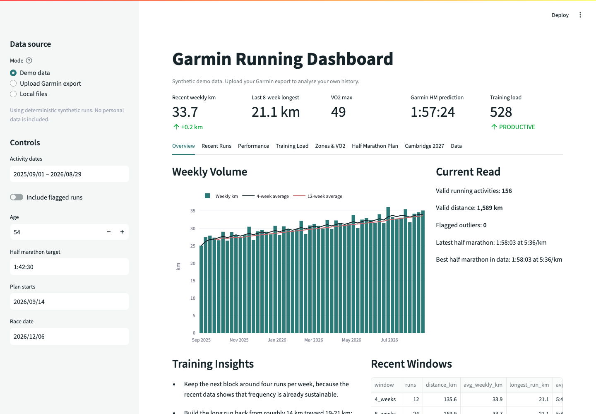

# Garmin Running Dashboard

[](https://github.com/javcamposz/garmin_running/actions/workflows/ci.yml)
[](https://www.python.org/)
[](LICENSE)

A privacy-conscious Streamlit dashboard that turns a Garmin account export into practical running analysis: recent load, pace and heart-rate trends, VO2 max, race predictions, and a configurable half-marathon plan.

The app opens with a deterministic synthetic dataset, so it is useful immediately and can be evaluated without sharing personal fitness or location data.



## Try It Locally

```bash
python3 -m venv .venv
source .venv/bin/activate
pip install -r requirements.txt
streamlit run app.py
```

Choose a source in the sidebar:

- **Demo data:** 52 weeks of generated, GPS-free running history.
- **Upload Garmin export:** process a Garmin account export zip in memory for the current session.
- **Local files:** analyse an export stored in `data/raw/` and retain normalized outputs locally.

## What It Covers

- Weekly mileage, recent training windows, activity mix, and training-load signals
- Pace, heart-rate, VO2 max, and Garmin race-prediction trends
- Recent-run classification with practical load and recovery observations
- Heart-rate zone analysis and acute/chronic distance ratio
- Configurable 8-12 week half-marathon planning
- A longer-range race-readiness roadmap
- Normalized activity data with outlier review and CSV export

## Use Your Garmin Export

Request the full archive through [Garmin Account Management](https://www.garmin.com/account/datamanagement/), rather than exporting a single activity.

For session-only analysis, start the app, select **Upload Garmin export**, and upload the zip directly. For local persistence:

```bash
mkdir -p data/raw
# Place the Garmin export zip in data/raw/
python3 garmin_etl.py
streamlit run app.py
```

You can also select a specific archive:

```bash
python3 garmin_etl.py --zip data/raw/garmin-export.zip
```

## Privacy Model

Garmin archives may contain sensitive health and location history. The repository therefore ignores all zip archives and generated processed data. Uploaded archives are processed in memory; the synthetic demo contains no GPS fields.

Before committing local work, verify that no personal data is staged:

```bash
git status --short
```

Never commit files from `data/raw/` or `data/processed/`.

## Tests

The test suite verifies export parsing, privacy-safe demo generation, formatting, and half-marathon plan boundaries:

```bash
pip install -r requirements.txt -r requirements-dev.txt
pytest
```

GitHub Actions runs the suite and compiles the application on every push and pull request.

## Project Structure

```text
app.py                  Streamlit dashboard
demo_data.py            Deterministic synthetic Garmin export
garmin_etl.py           Export parser, analysis, and plan generator
tests/                   Core regression tests
.github/workflows/ci.yml Continuous integration
.streamlit/config.toml   Theme and upload configuration
data/raw/                Local-only Garmin archives
```

## Deployment

The app can be deployed from this repository with [Streamlit Community Cloud](https://docs.streamlit.io/deploy/streamlit-community-cloud/deploy-your-app). Keep Demo data as the default source so a public deployment never depends on committed personal data.

## Disclaimer

Training observations are informational and are not medical advice. Reduce load or seek professional advice for unusual pain, illness, persistent fatigue, or health concerns.
